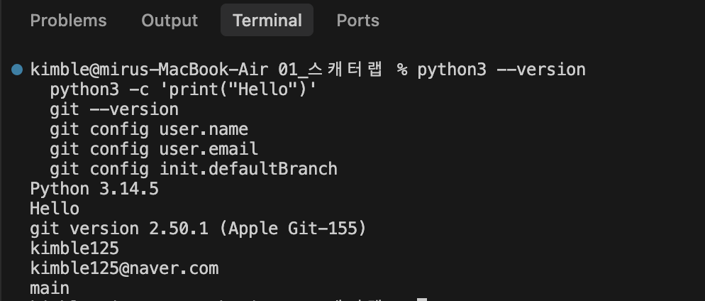
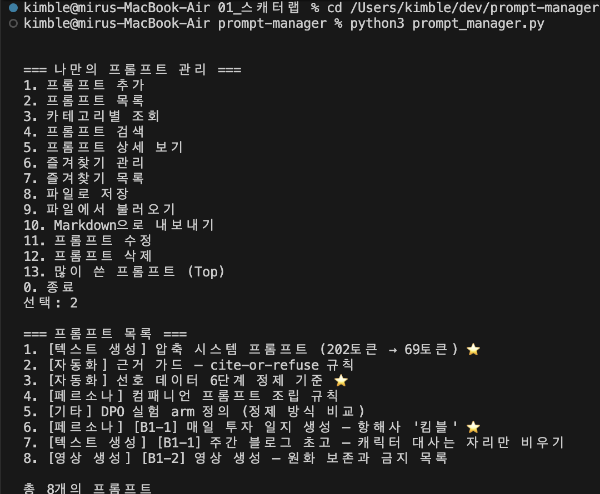
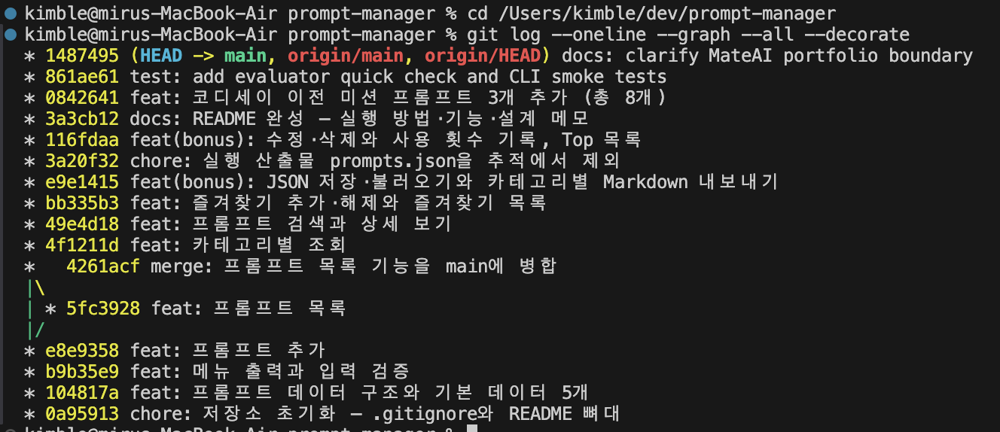

# 검증 근거 및 스크린샷

최종 점검일: 2026-08-28

## 1. 개발·실행 환경 검증

- Python 3.14.5에서 검증 (Python 3.10 이상 지원)
- Git 2.50.1 (Apple Git-155)
- 외부 의존성 패키지 없이 Python 표준 라이브러리만 사용



```bash
python3 --version
python3 -c 'print("Hello")'
git --version
git config user.name
git config user.email
git config init.defaultBranch
```

---

## 2. 프로그램 실행 화면

- 콘솔 기반 대화형 메뉴 시스템 (`show_menu()`, `main()`)
- 기본 프롬프트 8개(이전 미션 3개 + MateAI 실제 프롬프트 5개) 목록 조회
- 제목·내용 검색, 상세 보기, 즐겨찾기, 조회수 Top 목록 등 전체 기능 정상 동작



---

## 3. Git 브랜치 및 커밋 그래프

- 원본 저장소: <https://github.com/kimble125/prompt-manager>
- 총 16개 이상의 의미 있는 기능 단위 커밋
- `feature/prompt-list` 브랜치 생성 및 `main` 병합 커밋 (`4261acf`) 이력 확인



```bash
git log --oneline --graph --all --decorate
```

---

## 4. 자동 테스트 결과

```text
test_add_search_detail_and_favorite_flow ... ok
test_default_data_has_required_fields_and_previous_missions ... ok
test_invalid_menu_choice_returns_to_menu_before_exit ... ok
test_save_load_and_markdown_export_are_explicit ... ok

Ran 4 tests in 0.002s
OK
```

재현 명령:
```bash
python3 -m unittest discover -s tests -v
```
